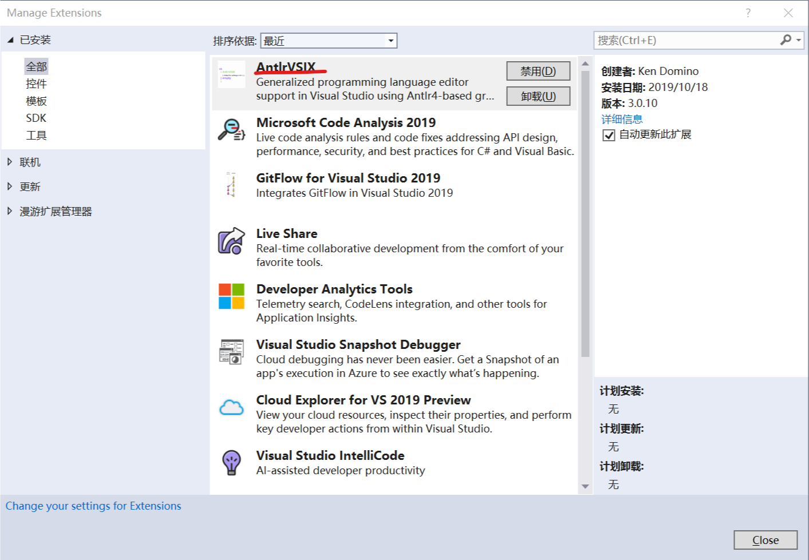
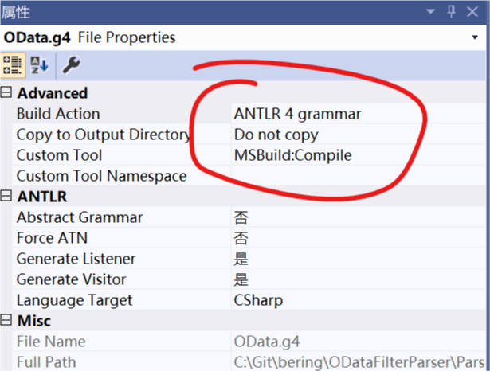

# 简介

本项目演示了如何使用Antlr4解析OData filter表达式,并转为成SQL的子句.由于仅演示将OData filter字符串解析后转换为SQL的过程,所以输出值不完全符合SQL标准.可以在此基础上修改输出ef查询、SqlSugar的查询条件.

## 如何使用

### 前置条件

- 安装`Java` 1.6或更高运行时
- 安装[antrl-complete-4.7.2.jar](https://www.antlr.org/download/antrl-complete-4.7.2.jar)
- 将`antrl-complete-4.7.2.jar`文件路径(含文件名)添加到`CLASSPATH`环境变量中
- 将`Java`安装路径添加到`JAVA_HOME`环境变量中

验证环境

```shell
java org.antlr.v4.Tool
```

输出以下内容表示成功

```text
ANTLR Parser Generator  Version 4.7.2
 -o ___              specify output directory where all output is generated
 -lib ___            specify location of grammars, tokens files
 -atn                generate rule augmented transition network diagrams
 ...
```

### 安装Visual Studio 插件



安装好插件以后编辑保存`*.g4`文件就能自动生成规则解析代码了.

如果说编译还是有问题,检查以下`*.g4`文件的属性,如下图所示.



还有可能是`Parser.csproj`文件中的配置路径不对,检查这两立项.

```xml
<PropertyGroup Condition="'$(JAVA_HOME)'==''">
  <JAVA_HOME>C:\Program Files\Java\jre1.8.0_231</JAVA_HOME>
</PropertyGroup>
<PropertyGroup Condition="'$(Antlr4ToolPath)'==''">
  <Antlr4ToolPath>C:\java\antlr-4.7.2-complete.jar</Antlr4ToolPath>
</PropertyGroup>
```

## 支持的表达式

当前示例支持解析的OData filter表达式有

- EQ
- NE
- GT
- GE
- LT
- LE
- StartsWith
- EndsWith
- Contains
- In
- ()

使用示例可以见`Test`项目.